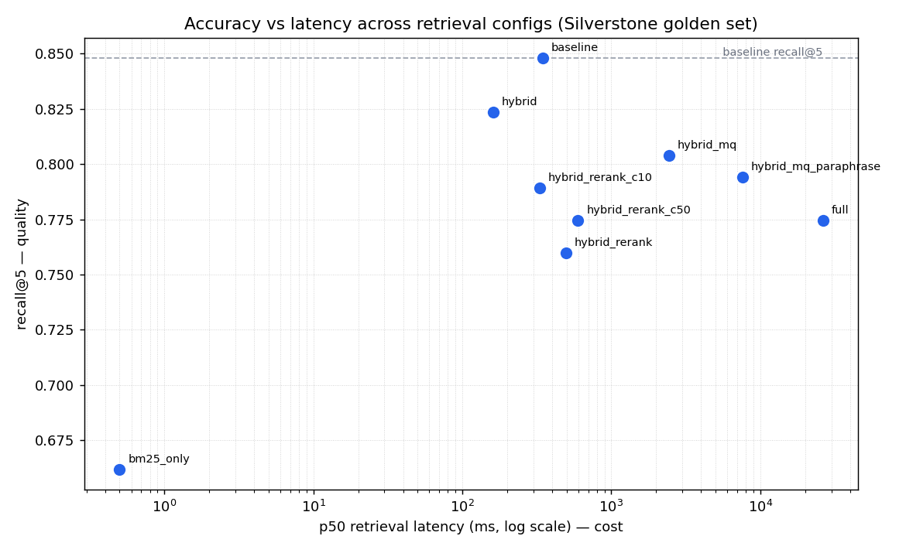

# Evaluation: Advanced Retrieval Ablation

**Corpus:** 2025 British Grand Prix (Silverstone), Race session, 35 chunks (15 stint +
20 result docs), 20 drivers. **Golden set:** 40 hand-verified questions (34 answerable +
6 unanswerable), `eval/golden_set.jsonl`. **Generator:** `llama3.2` (Ollama, temp 0).
**Judge:** Gemini (`gemini-2.5-flash`, independent of the generator); RAGAS measured for the
generation-enabled configs; see the RAGAS section.

Every number here is reproducible by running a script in this repo (CLAUDE.md R2). Nothing
is estimated or illustrative.

---

## TL;DR: the honest headline

**On this corpus, the naive dense baseline is the strongest single config on the
top-line ranking metrics, and no advanced technique beats it on recall@5 / MRR / nDCG@10.**
The advanced components each rescue *one* query type while regressing others, at real
latency cost. The one keeper is **hybrid** (dense + BM25), which closes the exact-term gap
and lifts deep recall for negligible added cost. Reranking and multi-query do not earn
their place **on this small, clean corpus**, and the value of the harness is being able to
*prove* that rather than assume the opposite.

This is a deliberately un-triumphant result. It is also the correct one, and the reason the
build measures every component instead of stacking them.

---

## The ablation table

Retrieval metrics over the 34 answerable questions; latency is p50/p95 of the retrieval
stage on a single laptop (see *Threats to validity*; treat latency as order-of-magnitude).

| Config | recall@5 | recall@10 | MRR | nDCG@10 | faithfulness | context_precision | context_recall | p50 (ms) | p95 (ms) |
|---|---|---|---|---|---|---|---|---|---|
| **Naive dense (baseline)** | **0.848** | 0.931 | **0.806** | **0.811** | 0.654 | **0.513** | **0.794** | 346 | 1118 |
| BM25 only | 0.662 | 0.706 | 0.594 | 0.614 | n/a | n/a | n/a | ~0.3 | ~0.4 |
| Hybrid (RRF) | 0.824 | **0.971** | 0.725 | 0.777 | 0.666 | 0.419 | 0.765 | 160 | 314 |
| Hybrid + multi-query (decompose) | 0.804 | 0.877 | 0.754 | 0.739 | n/a | n/a | n/a | 2445 | 4231 |
| Hybrid + multi-query (paraphrase) | 0.794 | 0.912 | 0.680 | 0.728 | n/a | n/a | n/a | 7589 | 13790 |
| Hybrid + rerank (k=10) | 0.789 | **0.971** | 0.694 | 0.749 | **0.733** | 0.404 | 0.735 | 331 | 476 |
| Hybrid + rerank (k=20) | 0.760 | 0.828 | 0.655 | 0.677 | 0.651 | 0.393 | 0.686 | 497 | 972 |
| Hybrid + rerank (k=50) | 0.774 | 0.814 | 0.636 | 0.662 | n/a | n/a | n/a | 598 | 1392 |
| **Full (hybrid + MQ + rerank)** | 0.774 | 0.853 | 0.654 | 0.691 | n/a | n/a | n/a | 26244 | 36514 |

**Bold** = best in column. `n/a` = not measured: BM25-only and the retrieval-only ablation
configs have no generation, and multi-query / rerank k=50 / full were not judged (single-laptop
generation-vs-reranker contention; see the RAGAS section). Best MRR among *non-baseline*
configs is multi-query decompose (0.754); best recall@10 is hybrid and hybrid+rerank@k=10 (0.971).

## Per-question-type recall@5: *where* each component acts

| Config | factual | comparative | exact_term | paraphrase |
|---|---|---|---|---|
| Naive dense (baseline) | **1.00** | 0.80 | 0.92 | 0.69 |
| BM25 only | 0.75 | 0.55 | **1.00** | 0.38 |
| Hybrid (RRF) | 0.88 | 0.75 | **1.00** | 0.69 |
| Hybrid + MQ (decompose) | 0.75 | 0.70 | 0.92 | **0.88** |
| Hybrid + MQ (paraphrase) | 0.88 | 0.60 | **1.00** | 0.75 |
| Hybrid + rerank (k=10) | 0.75 | **0.85** | 0.79 | 0.75 |
| Full | 0.75 | 0.80 | 0.79 | 0.75 |

Read this table as the actual argument of the project:
- **BM25 owns exact-term (1.00) and fails paraphrase (0.38)**: the textbook complementarity
  that justifies *fusing* the two legs rather than replacing one with the other.
- **Hybrid inherits BM25's exact-term win (1.00)** and keeps dense's paraphrase score; the
  fusion works as intended, closing the `e_05` "SOFT tyres" gap the baseline failed.
- **Multi-query decomposition owns paraphrase (0.88)** but *regresses comparative*: the mode
  built for comparatives didn't help them (see D8: RRF dilution + llama3.2 can't decompose
  entities it doesn't know, e.g. Ferrari→Hamilton+Leclerc).
- **Reranking (k=10) owns comparative (0.85)** but *breaks exact-term* (0.79): the
  out-of-domain cross-encoder promotes result docs over stint docs for compound queries.
- **No config is best everywhere.** Every gain is a local trade.

## Accuracy vs latency



Every config to the right of the baseline (i.e. slower) sits **at or below** its recall@5.
Hybrid is the only point that gets close to baseline quality at *lower* latency (the free
BM25 leg). Multi-query and the full stack are far to the right and clearly below: quality
*lost* for latency *spent*. The full pipeline's p50 (26 s) is inflated by CPU/memory
contention between the resident `llama3.2` expansion model and the torch cross-encoder
running in one process on one laptop; even discounting that artifact, it is the slowest and
lowest-value config.

Component latency, isolated:
- **BM25 leg:** ~0.3 ms (in-memory, 35 docs); effectively free.
- **Dense leg:** ~150–350 ms: one Ollama embed + one pgvector RPC; dominates a plain query.
- **RRF fusion:** <1 ms.
- **Multi-query:** +1.5–2 s per query (one extra LLM round-trip) plus N× the retrieval, the
  most expensive component by far.
- **Cross-encoder rerank:** a few hundred ms for ~20 pairs on CPU in isolation.

## Failure-case analysis: 3 the full pipeline still gets wrong

1. **`e_05`: "which drivers ran SOFT tyres in their final stint?" (exact_term).** Needs the
   three *stint* docs (HAM/LEC/STR). Every semantic config misranks this: dense smears across
   all "final stint" chunks regardless of compound; the cross-encoder actively promotes
   *result* docs that name the drivers over the stint docs that record the compound. **This is
   a structured attribute lookup wearing a natural-language costume**: the right tool is a
   metadata filter on `compound`, or a text-to-SQL router, not semantic retrieval + rerank.
2. **`f_01`: "what position did Hamilton finish?" (factual).** The *baseline answers this
   perfectly* (recall 1.00 on factual), but the **full pipeline drops it**: multi-query
   decomposition and the out-of-domain reranker shuffle the obvious `HAM_result` chunk out of
   the top-5. The fix is not a better component but *not over-engineering*: route simple
   factual lookups straight to dense. A concrete instance of feature-stacking causing harm.
3. **`c_02`: "whose tyres degraded less, Hamilton or Verstappen?" (comparative).** Even when
   both stint chunks are retrieved, answering requires comparing two signed degradation
   slopes, a numeric-reasoning step `llama3.2` (3B) does unreliably. Retrieval is necessary
   but not sufficient here; the honest next step is a text-to-SQL/analytical path or a stronger
   generator, not more retrieval.

**Common thread → what I'd build next.** The residual failures are *analytical/structured*
queries ("which compound", "who degraded less", "fastest average") that are a fundamental
mismatch for semantic retrieval; no amount of fusion or reranking fixes them. The next build
is a **query router with a text-to-SQL path** for aggregation/attribute queries, keeping the
semantic pipeline for genuinely fuzzy questions. This is out of scope for this build by design
(CLAUDE.md §5 P5).

## RAGAS (answer quality): judged by Gemini

RAGAS scores answer quality with an **independent judge** (`gemini-2.5-flash`, deliberately a
different model from the `llama3.2` generator; see DECISIONS D2). The harness
(`eval/ragas_eval.py`) runs the four metrics; `python -m eval.run_eval --config <cfg> --ragas
--ragas-workers 12` produces them (the `--ragas` flag force-enables generation + judging on
the retrieval-only ablation configs). Measured over the 34 answerable questions:

| Config | faithfulness | answer_relevancy | context_precision | context_recall |
|---|---|---|---|---|
| Naive dense (baseline) | 0.654 | 0.755 | **0.513** | **0.794** |
| Hybrid (RRF) | 0.666 | **0.801** | 0.419 | 0.765 |
| Hybrid + rerank (k=10) | **0.733** | 0.707 | 0.404 | 0.735 |
| Hybrid + rerank (k=20) | 0.651 | 0.706 | 0.393 | 0.686 |

**Reading (and it corroborates the retrieval story):** the **baseline has the best
`context_precision` (0.513) and `context_recall` (0.794)**: dense-only keeps the top-k
cleanest. Hybrid and reranking both *lower* precision (0.42 / 0.40), because BM25 and the
out-of-domain cross-encoder pull less-relevant chunks into the context, exactly the
mechanism the retrieval metrics show in D7/D9. Reranking (k=10) buys the best `faithfulness`
(0.733) by trading precision. **No config's answer quality clearly beats the baseline**: the
same honest headline as the ranking metrics, now confirmed by an independent judge.

**Not judged (left unmeasured, not estimated, R2):** the two multi-query configs, rerank
k=50, and the full stack. Forcing generation on top of the resident torch cross-encoder on a
single laptop triggers the CPU/memory contention documented above, making those runs
impractically slow to judge end-to-end. They can be filled on a machine without that
contention via the same `--ragas` command.

*(Implementation note: three fixes were needed to make RAGAS run against Gemini 2.5:
parallelise judge calls off the free-tier rate limit; set `thinking_budget=0` so the thinking
model doesn't exhaust its output budget; and override RAGAS's finish-reason check, which only
accepts lowercase `"stop"` while Gemini returns `"STOP"`. See `eval/ragas_eval.py`.)*

One judge-free groundedness signal was measured: **abstention rate = 1.00** on the baseline:
the pipeline refused all 6 unanswerable questions rather than hallucinating.

## Threats to validity

- **Small eval set (n≈40, 34 answerable)**: differences of a few points are within noise; the
  headline (baseline hard to beat; hybrid the one keeper) is directional, not a precise
  ranking. Per-type buckets are 6–10 questions each, so a single question moves a bucket ~0.1.
- **Single corpus, single race (35 docs)**: dense retrieval is near its ceiling here precisely
  *because* the corpus is tiny and semantically separable. On a larger, noisier corpus (many
  races, drivers, sessions) BM25, reranking and decomposition would very plausibly flip from
  net-negative to net-positive. **These conclusions are corpus-specific and stated as such.**
- **Single judge, and only a partial run**: RAGAS was measured for baseline, hybrid and the
  two smaller rerank configs, but the multi-query, rerank k=50 and full configs were not judged
  (single-laptop contention). It is one LLM judge (Gemini), so answer-quality is corroborating
  evidence, not the backbone; the retrieval metrics remain the trustworthy anchor.
- **Questions authored by the system's builder**: despite verification against FastF1 source,
  there is author bias in what was asked and labeled.
- **Latency on a shared laptop, separate runs**: treat p50/p95 as order-of-magnitude. The
  robust facts (BM25 free, dense ~hundreds of ms, MQ adds seconds, full is slowest) hold; exact
  cross-run comparisons do not.
- **Out-of-domain reranker**: `bge-reranker-base` is trained on general web relevance; its poor
  showing is partly a domain-fit issue, not proof that reranking is useless in general.

## Reproduce every number

```bash
# retrieval metrics for any config (RAGAS off):
python -m eval.run_eval --config configs/baseline.yaml --out eval/results/baseline.json --no-ragas
# ... repeat for bm25_only, hybrid, hybrid_mq, hybrid_mq_paraphrase,
#     hybrid_rerank{,_c10,_c50}, full
python scripts/plot_tradeoff.py          # regenerate docs/tradeoff.png
python eval/validate_golden.py           # golden-set integrity
python -m pytest backend/tests           # metric/fusion/pipeline unit tests
```

Every run appends to `eval/results/runs.jsonl` with its config hash + timestamp (never
overwritten). Design rationale for each component is in `docs/DECISIONS.md`.
